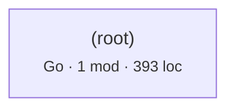

# Architecture map

Derived from source by automap 2.0. Every line is computed, not written. Regenerate with `automap map`; do not edit by hand.

## What this says about the system

Each item fired because a measurement crossed a threshold. The numbers and the evidence are from your code; the explanation is fixed text from a rule catalog, identical every time that rule fires on any repository. `automap rules` prints the catalog on its own so you can audit the claims before trusting them here. What none of it can tell you is why your team built it this way — that is what `automap adr` leaves blank.

| | count |
|---|---:|
| Worth attention | 1 |
| Notes | 1 |

### Worth attention · No test files were found anywhere in the tree.

**Why it matters.** Without tests, every finding in this document is harder to act on. Cycles, layer violations, and oversized components are all fixed by moving code, and moving code without tests means each fix carries risk that has nothing to do with the fix itself.

**What usually causes it.** Tests kept in a separate repository, or named in a way this tool does not recognise.

**What to do.** If they exist elsewhere, add their directory to `roots` or their naming to `test_dirs` in `.automap.json` so this check means something.

<sub>`ARCH-NOTESTS` · Testing</sub>

### Note · No layering declared, so layer checks are off.

**Why it matters.** Cycles and coupling are measurable without knowing your intent, but 'this dependency should not exist' is not. Declaring layers is how you tell the tool what the design is supposed to be, which turns a description into a check that can fail in CI.

**What usually causes it.** Most repositories never write the layering down; it lives in review comments and in whoever has been there longest.

**What to do.** Add a `layers` map to `.automap.json`, ordered top to bottom. Start with the layering you believe you have — the first run will tell you whether you have it.

<sub>`ARCH-NOLAYERS` · Evidence quality</sub>

## Inside the files

The section above reasons about the import graph, where an edge either exists or does not. This one reads inside files, and its evidence is weaker by construction. Python is analysed with its real grammar, so complexity, nesting, length and parameter counts are exact. Every other language is matched lexically against comment-stripped source: those rules report **the presence of a construct, not a proven defect**. There is no dataflow analysis here. A flagged line may be perfectly correct in context, and an unflagged file may still be wrong. Read these as places to look, not as a verdict.

| category | findings |
|---|---:|
| Scalability | 1 |

### Scalability

**Worth attention · SCL-INMEMSTATE** — 1 occurrence(s) across 1 file(s).

*Why it matters.* Module-level mutable state lives in one process. The moment a second instance runs — a second worker, a second pod, a rolling deploy — each has its own copy, and behaviour depends on which one served the request. It is also shared between concurrent requests within the process, which makes it a correctness problem before it is a scaling one.

*What usually causes it.* A cache, a registry, or a counter that was correct when the service ran as a single process, and was never revisited when it did not.

*What to do.* Decide whether the state is per-request, per-process, or global. Per-request belongs in the request context; global belongs in a shared store such as Redis or the database; per-process caches need an explicit bound and must tolerate being cold.

<details><summary>Evidence</summary>

- `offline.go:92` — `var blockedNetworkCalls = []`

</details>

---

The rest of this document is the evidence those findings were computed from.

## Coverage

What was read, and where every import went. Third-party means the target is expected to live outside this tree. Unaccounted means an import that looks local and resolved to nothing: those are edges missing from the graph below, usually a source root or path alias this tool has not been told about.

| Language | Fidelity | Files | Imports | Internal | Third-party | Unaccounted |
|---|---|---:|---:|---:|---:|---:|
| Go | structural | 1 | 8 | 0 | 8 | 0 |

## Shape

- 1 modules across 1 components
- 0 internal import edges, 0 component couplings
- 393 lines
- propagation cost 0% — the share of other components an average component can reach through import paths
- Go module `github.com/fabiocicerchia/offline`

## Component graph



Dashed edges came from heuristic scanners. Thick borders are in a cycle. Labels count import sites.

## Ways in, and where they lead

No routes, commands, jobs, or navigation links were recognised. Either this tree has no entry points of its own, or its framework is not one this tool knows how to read.

## The nouns

No type declarations found.

## Reachability from entry points

What each root actually pulls in, to a depth of three. Nothing imports these modules, so they are where a reader has to start.

**offline.go**

```
.  (Go)
```

## Coupling

| Component | Languages | Modules | LOC | Fan-in | Fan-out | Instability |
|---|---|---:|---:|---:|---:|---:|
| `(root)` | Go | 1 | 393 | 0 | 0 | 0.0 |

Instability is fan-out / (fan-in + fan-out). A component many things depend on that itself depends widely propagates change in both directions.

## Cycles

None at component level.

## External dependencies

Third-party packages. Standard-library imports are counted separately below, because a dependency you cannot remove is not a design decision.

| Package | Sites | Components | First site |
|---|---:|---:|---|
| `github` | 1 | 1 | offline.go:33 |
| `golang` | 1 | 1 | offline.go:34 |

5 standard-library modules imported; most used: `os` (2), `errors` (1), `flag` (1), `fmt` (1), `syscall` (1).

## Churn against size

Most-changed files in the last 12 months. This is where any map you carry in your head goes stale first.

| File | Lines touched | LOC | Language |
|---|---:|---:|---|
| `offline.go` | 597 | 393 | Go |

## Public surface

---

**Not derivable from code.** Why these boundaries were chosen, what was rejected, and what constraint each one holds. `automap adr` scaffolds one file per decision point with the facts filled in and those questions blank.
